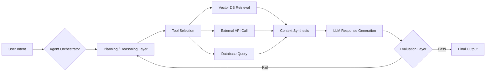

  
  
  
  

---

## 📑 Table of Contents

- [🎯 Mission](#-mission)
- [🌟 Key Features](#-key-features)
- [🧩 Architecture Philosophy](#-architecture-philosophy)
- [🛠 Intelligence Stack](#-intelligence-stack)
- [🚀 Active R&D](#-active-rd-current-focus)
- [🗺️ Roadmap](#️-roadmap--whats-next)
- [📈 Engineering Impact](#-engineering-impact)
- [🌐 Get in Touch](#-get-in-touch)

---

## 🎯 Mission

> I don't just write prompts — I engineer **autonomous systems**.

As an **Agentic AI Engineer**, my focus is on building systems that don't merely respond, but actively **reason, use tools, and solve complex, multi-step problems** in production environments.

| Core Principle | Description |
|---|---|
| 🏗️ **Architect** | Design resilient, fault-tolerant multi-agent systems that recover gracefully from failure. |
| 🛠️ **Refine** | Build RAG pipelines engineered for zero-hallucination, high-fidelity outputs. |
| ⛓️ **Orchestrate** | Connect LLMs to real-world APIs, databases, and execution environments. |

---

## 🌟 Key Features

A breakdown of the capabilities and engineering practices that define my work:

- 🧠 **Multi-Agent Orchestration** — Designing agent-to-agent communication graphs with state persistence and conditional routing.
- 🔍 **Retrieval-Augmented Generation (RAG)** — Building high-precision retrieval pipelines with hybrid search (semantic + keyword) to minimize hallucination.
- 🔗 **Tool-Calling & Function Execution** — Connecting LLMs to live APIs, databases, and internal tooling for real-world action-taking.
- 📊 **Automated Evaluation Loops** — Continuous agent reliability testing using frameworks like RAGAS and DeepEval.
- ☁️ **Edge & On-Device AI** — Deploying optimized, quantized models for privacy-first, low-latency inference.
- 🐳 **Production-Grade Deployment** — Containerized, CI/CD-driven delivery pipelines for AI services at scale.
- 📉 **Experiment Tracking** — Structured tracking of fine-tuning runs and model evaluation metrics via Weights & Biases.

---

## 🧩 Architecture Philosophy

A representative view of how I structure agentic systems — from user intent to tool-augmented action:

**Pipeline Summary:**

1. **Intent Capture** — User input is parsed and routed to the orchestrator.
2. **Reasoning Layer** — The agent plans a sequence of steps (LangGraph state machine).
3. **Tool Execution** — The agent dynamically selects and invokes tools (retrieval, APIs, databases).
4. **Context Synthesis** — Retrieved data is merged into a coherent context window.
5. **Generation & Self-Evaluation** — Output is generated, then scored against reliability metrics before being returned.

---

## 🛠 Intelligence Stack

### 🧠 Agentic Orchestration
*Frameworks that bring LLMs to life*

  
  
  
  

### ⚙️ Production Engineering
*Building the backbone*

  

### 🧬 LLM & Vector Ops
*Fine-tuning & retrieval infrastructure*

| Technology | Use Case |
| :--- | :--- |
| **OpenAI / Anthropic** | Frontier model integration |
| **Hugging Face** | Local LLM deployment & fine-tuning |
| **Pinecone / Qdrant** | High-scale vector search |
| **Weights & Biases** | Experiment tracking & evaluation |

### 📦 Full Stack Snapshot

| Layer | Tools |
|---|---|
| **Languages** | Python |
| **Backend / APIs** | FastAPI |
| **Data Stores** | PostgreSQL, MongoDB, Redis |
| **Infra / DevOps** | Docker, GitHub Actions, Linux |
| **Vector DBs** | Pinecone, Qdrant |
| **Evaluation** | RAGAS, DeepEval, Weights & Biases |

---

## 🚀 Active R&D (Current Focus)

- 🤖 **Compound AI Systems** — Moving beyond single prompts into complex, multi-step agent loops.
- 📊 **Evaluation Frameworks** — Building automated reliability tests for agent behavior (RAGAS, DeepEval).
- ☁️ **Edge AI** — Running optimized models on-device for privacy and speed.

---

## 🗺️ Roadmap & What's Next

> Planned directions for upcoming exploration and skill-building.

- [ ] **Agent Memory Systems** — Long-term, persistent memory architectures for multi-session agents.
- [ ] **Self-Correcting Pipelines** — Agents that critique and refine their own outputs autonomously.
- [ ] **Multi-Modal Agents** — Extending tool-calling agents to handle vision and audio inputs.
- [ ] **Open-Source Agent Toolkit** — Publishing reusable, production-ready agent orchestration templates.
- [ ] **Cost-Aware Routing** — Dynamic model selection based on task complexity and inference cost.

---

## 📈 Engineering Impact

  
  

  

---

## 🌐 Get in Touch

  

  

  

